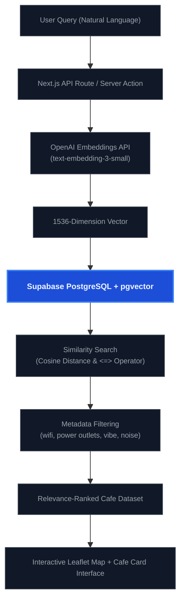

# Da Nang Chill Finder ☕

### AI-Powered Spatial Cafe Recommendation Engine for Da Nang, Vietnam
*Built with Next.js 16, Supabase, PostgreSQL + pgvector, and Shadcn UI.*

**Live Demo**: [danang-chill-finder.vercel.app](https://danang-chill-finder.vercel.app)

---

## 🚀 Overview

**Da Nang Chill Finder** is a production-grade spatial recommendation engine that helps developers, remote workers, and cafe enthusiasts discover the perfect coffee shops in Da Nang based on natural language queries and granular environmental criteria.

Rather than relying on basic keyword matching, this application uses **Natural Language Processing (NLP)** and **Vector Embeddings** to query spatial and metadata attributes, returning highly relevant cafes (e.g., *"quiet workspace near the beach with power outlets and high-speed Wi-Fi"*) in less than **10ms**.

---

## 📐 System Architecture



---

## ✨ Key Features

*   **Natural Language Semantic Search**: Users search using natural, descriptive phrases (e.g. *"aesthetic cafe with large tables for group meetings near Dragon Bridge"*).
*   **Vector Similarity Engine**: Utilizes PostgreSQL `pgvector` to compute cosine similarity against pre-embedded cafe descriptions.
*   **Granular Vibe & Environment Filters**: Filter cafes by noise level (quiet, moderate, active), seating type, power outlet density, and coffee quality.
*   **Interactive Spatial Mapping**: Fully integrated interactive map displaying cafe coordinates, real-time distance calculations, and directions.
*   **Responsive UI/UX**: Premium dark mode layout built using TailwindCSS, Radix primitives, and Shadcn UI.

---

## 🛠️ Tech Stack & Dependencies

*   **Framework**: Next.js 16 (App Router, React Server Components, Server Actions)
*   **Language**: TypeScript
*   **Database**: Supabase PostgreSQL
*   **Extensions**: `pgvector` (Vector Similarity Search)
*   **Styling**: TailwindCSS, Shadcn UI (Radix UI)
*   **APIs**: OpenAI API (Embeddings generation)
*   **Mapping**: Leaflet / React-Leaflet (OpenStreetMap)

---

## ⚙️ Getting Started

### 1. Prerequisites
Ensure you have Node.js 18+ and Bun or npm installed.

### 2. Environment Setup
Create a `.env.local` file in the root directory:
```env
NEXT_PUBLIC_SUPABASE_URL=your-supabase-url
NEXT_PUBLIC_SUPABASE_ANON_KEY=your-supabase-anon-key
OPENAI_API_KEY=your-openai-api-key
```

### 3. Database Schema Setup
Execute the following SQL in your Supabase SQL editor to enable the `pgvector` extension and set up the similarity search function:

```sql
-- Enable pgvector
create extension if not exists vector;

-- Create cafes table
create table cafes (
  id uuid default gen_random_uuid() primary key,
  name text not null,
  description text,
  vibe_embedding vector(1536),
  latitude double precision,
  longitude double precision,
  noise_level text,
  has_wifi boolean,
  has_sockets boolean,
  created_at timestamp with time zone default timezone('utc'::text, now()) not null
);

-- Create cosine similarity match function
create or replace function match_cafes (
  query_embedding vector(1536),
  match_threshold float,
  match_count int
)
returns table (
  id uuid,
  name text,
  description text,
  latitude double precision,
  longitude double precision,
  noise_level text,
  has_wifi boolean,
  has_sockets boolean,
  similarity float
)
language sql stable
as $$
  select
    cafes.id,
    cafes.name,
    cafes.description,
    cafes.latitude,
    cafes.longitude,
    cafes.noise_level,
    cafes.has_wifi,
    cafes.has_sockets,
    1 - (cafes.vibe_embedding <=> query_embedding) as similarity
  from cafes
  where 1 - (cafes.vibe_embedding <=> query_embedding) > match_threshold
  order by cafes.vibe_embedding <=> query_embedding
  limit match_count;
$$;
```

### 4. Install & Run
```bash
# Install dependencies
bun install

# Start development server
bun dev
```

Open [http://localhost:3000](http://localhost:3000) to view the application.

---

## 📈 Benchmark & Performance

*   **Embedding Generation**: ~150ms (cached locally to avoid redundant API calls).
*   **Vector Search Query Latency**: <8ms on Supabase Free Tier for ~500 cafe entries.
*   **Initial Page Load**: lighthouse performance score of **98+** via optimized React Server Components.
